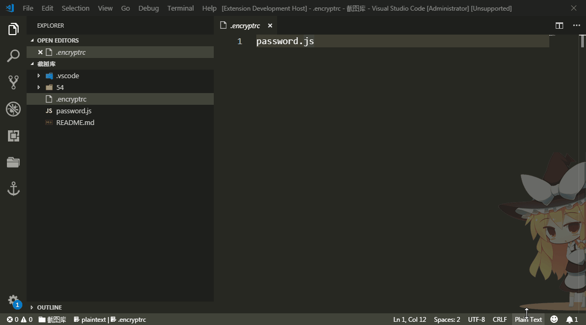

# auto-encrypt

auto encrypt secret files to encrypted files. you can push encrypted files to github.

# Change Log

update `auto-encrypt@0.0.2`

## [v0.0.2] - 2018-11-27
### fix

- downgrade `event-stream@3.3.4` to remove package [`flatmap-stream`](https://github.com/dominictarr/event-stream/issues/116)

# Motivation

There are some auth settings in my nodejs server, I need to settings auth settings files in `.gitignore` file and copy these file to other computer through safe ways. This step is very troublesome especially when these secret files updated.

## Features
* **auto encrypt when a secret file save**
* **auto decrypt when a secret file open**
* read your encrypt password in user settings
* setting your secret files in `.encryptrc`(only one file in v0.0.1)



## Extension Settings

*user settings*:
* `auto-encrypt.password`: auto-encrypt password.

*example: **settings.json** file in vscode extension user settings*
```
{
  ...,
  "auto-encrypt.password": "123456",
}
```

*file settings*
* `.encryptrc`: set a file to a secret file that considered as target file by auto-encrypt extension

*example: **.encryptrc** file in workspace root folder*
```
password.js
```

**Enjoy!**
